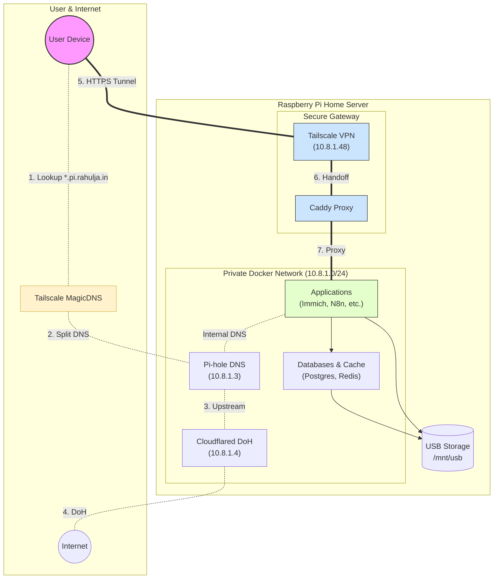

# Raspberry Pi Home Lab (Docker)

This repository contains the Docker Compose configuration for a comprehensive home lab setup running on a Raspberry Pi (optimized for Pi 5). It integrates various self-hosted services using a custom bridge network and Tailscale for secure remote access.

## 🚀 Overview

The stack is designed to be efficient and secure, utilizing **Caddy** as a reverse proxy with Cloudflare DNS validation for automatic SSL certificates. A specific subnet (`10.8.1.0/24`) is used to assign static IPs to containers, facilitating easy internal DNS resolution via Pi-hole.

### Core Infrastructure
- **Caddy:** Reverse proxy handling `*.pi.rahulja.in` domains.
- **Tailscale:** VPN and subnet router for secure remote access.
- **Pi-hole:** Network-wide ad blocking and local DNS.
- **Cloudflared:** DNS-over-HTTPS (DoH) tunnel for secure upstream DNS.

## 📐 Architecture

The following diagram illustrates the simplified flow of **DNS resolution** (dotted lines) and **Secure Access** (solid lines).



## 🛠️ Services & IP Assignments

The following services are configured with static IPs in the `10.8.1.0/24` subnet:

| Service | Internal IP | External URL (Example) | Description |
| :--- | :--- | :--- | :--- |
| **Pi-hole** | `10.8.1.3` | `pihole.pi.rahulja.in` | DNS Sinkhole & Ad Blocker |
| **Cloudflared** | `10.8.1.4` | `cloudflaredns.pi.rahulja.in` | DoH Proxy |
| **Immich** | `10.8.1.6` | `immich.pi.rahulja.in` | Self-hosted Photo & Video Management |
| **Transmission** | `10.8.1.23` | `trans.pi.rahulja.in` | Torrent Client |
| **Paperless-ngx** | `10.8.1.32` | `pngx.pi.rahulja.in` | Document Management System |
| **Filebrowser** | `10.8.1.34` | `filebrowser.pi.rahulja.in` | Web-based File Manager |
| **Homarr** | `10.8.1.35` | `homarr.pi.rahulja.in` | Dashboard for your services |
| **Tailscale** | `10.8.1.48` | N/A | VPN Mesh Network |
| **Web Test** | `10.8.1.49` | `webtest.pi.rahulja.in` | Connectivity Test (Whoami) |
| **N8n** | `10.8.1.53` | `n8n.pi.rahulja.in` | Workflow Automation |
| **SearXNG** | `10.8.1.54` | `searxng.pi.rahulja.in` | Privacy-respecting Metasearch Engine |
| **Paisa** | `10.8.1.56` | `paisa.pi.rahulja.in` | Personal Finance Manager |
| **Homepage** | `10.8.1.57` | `homepage.pi.rahulja.in` | Modern Startpage |

*Note: Immich auxiliary services (ML, Redis, DB) occupy IPs `10.8.1.8`, `10.8.1.9`, and `10.8.1.10` respectively.*

## ⚙️ Configuration

### Environment Variables
The setup relies heavily on environment variables for sensitive data and path configurations.
1.  Copy `example.env` to `.env`.
2.  Fill in the required fields, especially:
    -   `CLOUDFLARE_API_TOKEN` (for Caddy SSL)
    -   `TAILSCALE_AUTH_KEY` (for Tailscale connection)
    -   Data paths (defaulting to `/mnt/usb/...`)

### Networking
-   **Network Name:** `wg-easy`
-   **Subnet:** `10.8.1.0/24`
-   **Gateway:** `10.8.1.1` (Default Docker bridge gateway)

### Storage
Most heavy data (media, databases) is mapped to an external USB drive mounted at `/mnt/usb`. Ensure this mount point exists and has correct permissions, or update the `.env` file to point to your desired locations.

## 📦 Usage

1.  **Clone the repository:**
    ```bash
    git clone <repository-url>
    cd <repository-directory>
    ```

2.  **Prepare Environment:**
    ```bash
    cp example.env .env
    # Edit .env with your specific configuration
    nano .env
    ```

3.  **Start Services:**
    ```bash
    docker-compose up -d
    ```

4.  **Access Services:**
    Open your browser and navigate to the configured domains (e.g., `https://homarr.pi.rahulja.in`). Ensure your DNS (likely Pi-hole) is correctly pointing these domains to your Nginx/Caddy instance or that you have local host entries if testing offline.

## 📝 Notes

-   **Caddy & Tailscale:** Caddy is configured with `network_mode: service:tailscale`, sharing the Tailscale container's network namespace. This allows Caddy to seamlessly serve content over the Tailscale mesh network and resolve internal IPs on the `wg-easy` bridge.

-   **Internal DNS:** All application containers are configured with `dns: 10.8.1.3`, ensuring they use Pi-hole for both internal and external name resolution.

-   **Immich:** Requires a significant amount of RAM for machine learning tasks.

-   **Extended Documentation:** Detailed architecture diagrams in `.drawio` and `.svg` formats can be found in the `docs/` directory.
